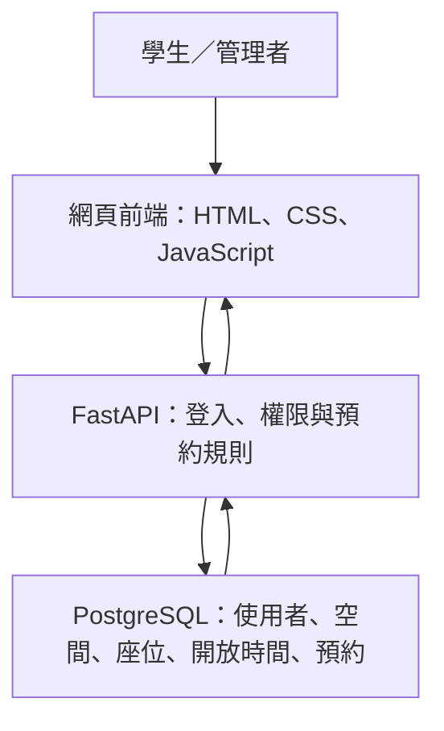
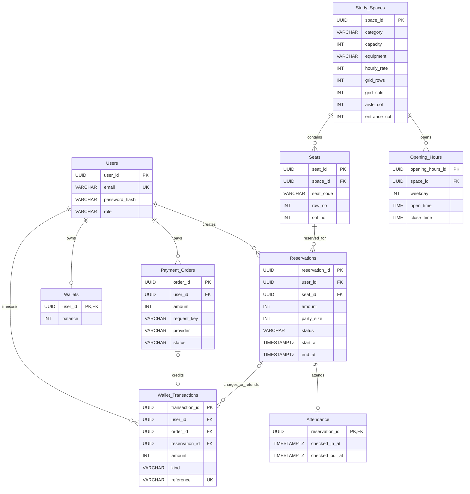
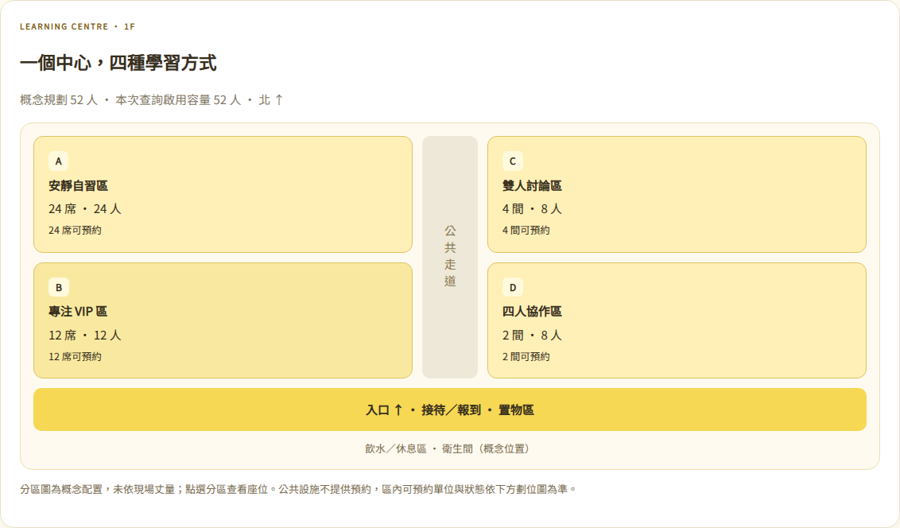

# 校園自習空間預約系統
## 系統需求規格書（SRS）

**版本：** 2.1  
**日期：** 2026 年 10 月 7 日  
**課程：** 資料庫系統

---

## 1. 專案概述

### 1.1 開發背景與痛點
學生找自習座位時，通常需要到現場確認空位，或透過不同管道詢問空間使用狀況。多人同時使用同一空間時，可能發生座位資訊不一致或重複預約。本系統提供統一的空間查詢與預約介面，由資料庫檢查開放時間和座位衝突，讓學生能查詢、建立及管理自己的預約。

### 1.2 系統目標
1. 學生可依日期和時段查詢開放空間及可預約座位。
2. 系統拒絕超出開放時間或與既有有效預約重疊的預約。
3. 管理者可維護空間、座位及每週開放時間；停用的空間或座位不得接受新預約。

### 1.3 使用者與權限
| 角色 | 權限 |
|---|---|
| 學生（STUDENT） | 登入、查詢及劃位、建立／查看／取消自己的預約、錢包、模擬付款、報到與離場。 |
| 管理者（ADMIN） | 維護空間、座位配置與開放時間；建立學生帳號；查看預約、報到及付款資料。 |

帳號由管理者透過後台建立，不提供學生自行註冊。新帳號的點數錢包餘額為 0。

### 1.4 系統範圍與限制
本系統管理一般座位、VIP、雙人／四人研究室，提供設備資訊、管理者可設定的座位配置、入口與走道、當日時段、預約、點數錢包、模擬付款、退點與報到／離場。研究室視為一個可預約單位，同時只能由一筆有效預約使用，單次使用人數不得超過容量。

預約不跨日；不處理國定假日、臨時休館、通知服務、包月方案、磁卡硬體或正式信用卡收款。付款目前為 DEMO 模擬交易，不收取真實款項。正式金流需商家帳號、伺服器端驗簽、付款回呼與對帳，尚未實作。一般／VIP／雙人室／四人室的示範價格為 20／35／60／100 點每小時，可由管理者修改；這些價格是本專題展示資料，並非櫻橋的現行價格。

既有空間保留原資料並以免費一般座位初始化。示範座位配置並非真實場地平面圖；管理者須依現場設定座標、入口、走道。

---

## 2. 系統架構與技術選型

### 2.1 高階架構圖

瀏覽器前端呼叫 FastAPI REST API。後端驗證登入身分、角色、開放時間及預約衝突，再透過參數化查詢讀寫 PostgreSQL，並將結果回傳前端。

### 2.2 技術選型
| 層級 | 選用技術 | 理由 |
|---|---|---|
| 前端 | HTML、CSS、JavaScript | 製作查詢、預約及管理介面，適合小型課程專題。 |
| 後端 | Python FastAPI | 建立 REST API，驗證請求資料及處理預約規則。 |
| 資料庫 | PostgreSQL | 支援主外鍵、檢查限制、交易及時間區間衝突檢查。 |
| 身分驗證 | JWT | 登入後識別使用者及角色。 |
| 密碼保護 | bcrypt | 雜湊密碼後儲存，避免保存明文。 |

---

## 3. 功能性需求（FR）

### FR-01 使用者登入
- **觸發：** 使用者送出 Email 與密碼。
- **輸入：** Email、密碼。
- **處理：** 依 Email 查詢帳號，以 bcrypt 驗證密碼；成功後簽發有效期限 2 小時且包含 user_id、role 的 JWT。
- **輸出：** 成功回傳 HTTP 200 與 JWT；帳密錯誤回傳 HTTP 401。不得回傳 password_hash。

### FR-02 查詢空間與可用座位
- **觸發：** 學生選擇日期、開始時間、結束時間後送出查詢。
- **輸入：** 日期、start_at、end_at。
- **處理：** 驗證結束時間晚於開始時間且位於同一日期；查詢啟用中的空間與座位；將不在開放時段內或與 RESERVED 預約重疊的座位標記為不可預約。
- **輸出：** 回傳空間與啟用座位，包含 is_available；已占用或非開放時間的座位標記不可用，供配置圖呈現。輸入格式錯誤回傳 HTTP 422。查詢 API 使用 date、start_time、end_time，單一日期搭配兩個時間欄位，禁止反向時段。

### FR-03 建立預約
- **觸發：** 已登入學生選定座位與時段並送出。
- **輸入：** seat_id、start_at、end_at。
- **處理：** 驗證 JWT 角色為 STUDENT；確認座位及空間啟用；確認時段在開放時間內、結束時間晚於開始時間且位於同一日期；在資料庫交易中建立預約並扣除足額點數，建立扣點交易紀錄，阻止同座位有效預約時間重疊。伺服器依目前費率計算金額；前端傳expected_amount時若金額變更回傳409，要求重新確認；不足額回傳 HTTP 402，預約與扣點皆不成立。
- **輸出：** 成功回傳 HTTP 201 與 reservation_id；時間衝突回傳 HTTP 409；超出開放時間或輸入錯誤回傳 HTTP 422。

### FR-04 查詢個人預約
- **觸發：** 已登入學生開啟「我的預約」。
- **輸入：** JWT；可選 date（YYYY-MM-DD）或 status（RESERVED／CANCELLED）篩選。
- **處理：** 僅查詢 JWT 所屬 user_id 的預約，回傳空間、座位、起訖時間、付款、報到及取消可用狀態；提供明細 API。
- **輸出：** 回傳該學生的預約清單；未登入回傳 HTTP 401。

### FR-05 取消預約
- **觸發：** 學生在預約開始前取消自己的預約。
- **輸入：** reservation_id、JWT。
- **處理：** 確認預約存在、屬於目前學生、狀態為 RESERVED 且尚未開始；確認尚未報到；將狀態改為 CANCELLED，不刪除歷史紀錄；付費預約在同一交易內全額退點。
- **輸出：** 成功回傳 HTTP 200；取消他人預約回傳 HTTP 403；已開始或已取消的預約不得再次取消。

### FR-06 管理空間與座位
- **觸發：** 管理者新增、修改或停用空間或座位。
- **輸入：** 空間名稱、位置、座位代碼、啟用狀態。
- **處理：** 僅 ADMIN 可執行；同一空間內座位代碼不可重複；停用採軟停用，不刪除已有預約關聯的資料。
- **輸出：** 成功回傳 HTTP 200 或 201；非管理者回傳 HTTP 403；欄位錯誤回傳 HTTP 422。

### FR-07 管理每週開放時間
- **觸發：** 管理者新增或修改空間每週開放時間。
- **輸入：** space_id、weekday（1 至 7）、open_time、close_time。後台顯示目前週一至週日設定，修改前帶入既有時間。
- **處理：** 僅 ADMIN 可執行；確認空間存在、close_time 晚於 open_time；同一空間同一星期最多一筆開放時段。
- **輸出：** 成功回傳 HTTP 200；空間不存在回傳 HTTP 404；時間不合法回傳 HTTP 422；非管理者回傳 HTTP 403。

---

### FR-08 空間類型與配置圖
- GENERAL／VIP 容量為1；ROOM2 容量為2；ROOM4 容量為4。顯示類型、每單位容量、設備、每小時價格，可依類型篩選。
- 座位以 row_no、col_no 儲存實際相對位置，空間配置為 grid_rows × grid_cols。管理者可編輯名稱、位置、設備、價格、配置、入口與走道。
- 座位不可超出配置範圍、位於走道或與其他座位同一座標；停用座位仍保留其位置。新增座位可指定座標，兩個座標皆0則自動選第一個空位。
- 縮小配置或調整走道時，若覆蓋既有座位則回傳 HTTP 422。占用位置回傳 HTTP 409。

### FR-09 當日時段
- 學生選日期查看各空間的開放時間，以及各座位已有 RESERVED 預約的起訖時間。
- API：GET /api/spaces/{space_id}/schedule?date=YYYY-MM-DD。
- 不公開其他預約人的 Email、user_id 或預約編號；已取消預約不占用時段。

### FR-10 管理者建立學生帳號
- 僅 ADMIN 可建立學生帳號及檢視帳號清單，無法從此端點建立管理者。
- Email 正規化為小寫；密碼至少8字元且UTF-8長度最多72位元組，bcrypt rounds=10。
- 帳號與零餘額錢包在同一交易建立；重複 Email 回傳409，格式錯誤422，學生存取403。

### FR-11 點數錢包、儲值訂單與模擬付款
- 每位學生一個錢包；1點=NT$1，金額以整數處理。學生只能看自己的餘額、付款訂單、入帳／扣點／退點明細。
- 儲值金額為50至10,000。建立訂單後為PENDING，不立即入帳。學生確認模擬付款後成為PAID並入帳；未付款可取消為CANCELLED。
- 唯一(user_id, request_key)防止重複建立相同儲值請求；重用請求鍵但金額不同回傳409。
- 已PAID訂單再次確認回傳原訂單，不重複入帳。交易reference唯一，避免重複付款／退款。
- PAYMENT_MODE=demo（預設）開啟模擬付款，畫面明示「不扣取真實款項」。其他值停用儲值及模擬確認，回傳503；既有點數仍可使用。
- 管理者可查看所有儲值付款訂單及狀態，不回傳密碼或支付憑證。

### FR-12 預約計費、扣點與退點
- 計費分鐘數=ceil((end_at-start_at)/60秒)；應扣點數=ceil(hourly_rate × 計費分鐘數 / 60)。研究室按整間計費，與人數無關。
- 以建立預約當下費率計算；amount為不可變的價格快照，之後修改費率不影響既有預約或退款。
- 預約、扣點與BOOKING紀錄在同一資料庫交易內完成。UPDATE wallets SET balance=balance-amount WHERE balance>=amount 防止負餘額。
- 座位衝突或不足額時回滾全部操作。0點預約不建立點數交易，付款狀態FREE。
- 開始前且未報到可取消一次，全額退原amount，不刪歷史。取消後顯示REFUNDED（有扣點）或FREE（免費）。

### FR-13 報到與離場
- 僅本人可操作，且預約必須為RESERVED。報到時段為[start_at-15分鐘, end_at)，其他時段409。
- 每筆預約最多一筆Attendance；再次報到409。報到後不可取消，即使仍在開始時間之前。
- 已報到可離場一次；未報到或重複離場409。提前離場不退點且不提前釋出座位，以原預約結束時間為準。
- 列表依時間與Attendance派生WAITING、CHECKED_IN、CHECKED_OUT、NOT_ATTENDED、CANCELLED。NOT_ATTENDED不自動退款。
- 此報到是本人網頁按鈕操作，不具實體門禁、GPS或現場驗證效力。管理者總覽可見報到／離場時間。

---

## 4. 資料模型與結構設計

### 4.1 ERD

下圖列出九個業務資料實體、主鍵（PK）、外鍵（FK）及實體間的一對多關係。欄位型態與完整限制詳見 4.2 資料字典。

**關係與唯一性：** 一位使用者可建立多筆預約；每筆預約只屬於一位使用者及一個座位。一個空間可包含多個座位及多筆每週開放時段。`Seats` 的 `(space_id, seat_code)` 與 `Opening_Hours` 的 `(space_id, weekday)` 分別具有複合唯一限制。

### 4.2 資料字典

#### Users（使用者）
| 欄位 | 型態 | PK/FK | NULL | 預設值／限制 | 說明 |
|---|---|---|---|---|---|
| user_id | UUID | PK | 否 | 應用程式 uuid4() | 使用者識別碼 |
| email | VARCHAR(255) | — | 否 | UNIQUE | 登入 Email |
| password_hash | VARCHAR(255) | — | 否 | — | bcrypt 雜湊密碼 |
| role | VARCHAR(20) | — | 否 | CHECK IN ('STUDENT','ADMIN') | 使用者角色 |
| created_at | TIMESTAMPTZ | — | 否 | CURRENT_TIMESTAMP | 建立時間 |

#### Study_Spaces（自習空間）
| 欄位 | 型態 | PK/FK | NULL | 預設值／限制 | 說明 |
|---|---|---|---|---|---|
| space_id | UUID | PK | 否 | 應用程式 uuid4() | 空間識別碼 |
| name | VARCHAR(100) | — | 否 | — | 空間名稱 |
| location | VARCHAR(255) | — | 否 | — | 空間位置 |
| is_active | BOOLEAN | — | 否 | TRUE | 是否接受新預約 |

#### Seats（座位）
| 欄位 | 型態 | PK/FK | NULL | 預設值／限制 | 說明 |
|---|---|---|---|---|---|
| seat_id | UUID | PK | 否 | 應用程式 uuid4() | 座位識別碼 |
| space_id | UUID | FK → Study_Spaces.space_id | 否 | — | 所屬空間 |
| seat_code | VARCHAR(30) | — | 否 | UNIQUE(space_id, seat_code) | 空間內座位代碼 |
| is_active | BOOLEAN | — | 否 | TRUE | 是否可供新預約 |

#### Opening_Hours（開放時間）
| 欄位 | 型態 | PK/FK | NULL | 預設值／限制 | 說明 |
|---|---|---|---|---|---|
| opening_hours_id | UUID | PK | 否 | 應用程式 uuid4() | 開放時間識別碼 |
| space_id | UUID | FK → Study_Spaces.space_id | 否 | UNIQUE(space_id, weekday) | 所屬空間 |
| weekday | INTEGER | — | 否 | CHECK BETWEEN 1 AND 7 | 星期一為 1、星期日為 7 |
| open_time | TIME | — | 否 | — | 開放時間 |
| close_time | TIME | — | 否 | CHECK close_time > open_time | 關閉時間 |

#### Reservations（預約）
| 欄位 | 型態 | PK/FK | NULL | 預設值／限制 | 說明 |
|---|---|---|---|---|---|
| reservation_id | UUID | PK | 否 | 應用程式 uuid4() | 預約識別碼 |
| user_id | UUID | FK → Users.user_id | 否 | — | 預約學生 |
| seat_id | UUID | FK → Seats.seat_id | 否 | — | 預約座位 |
| start_at | TIMESTAMPTZ | — | 否 | — | 預約開始時間 |
| end_at | TIMESTAMPTZ | — | 否 | CHECK end_at > start_at | 預約結束時間 |
| status | VARCHAR(20) | — | 否 | DEFAULT 'RESERVED'; CHECK IN ('RESERVED','CANCELLED') | 預約狀態 |
| created_at | TIMESTAMPTZ | — | 否 | CURRENT_TIMESTAMP | 建立時間 |

**預約衝突限制：** 同一 seat_id 的 RESERVED 時間區間不得重疊。區間採含開始、不含結束規則，因此一筆預約 10:00 結束時，下一筆可於 10:00 開始。後端須在交易中建立預約；PostgreSQL 可搭配 btree_gist exclusion constraint，避免並行請求造成重疊有效預約。

---

### 4.3 V2 擴充欄位與新增資料表

所有新業務欄位預設NOT NULL，除明確標示可空的欄位。主外鍵UUID沿用現有資料模型，索引與唯一限制由資料庫建立；類型／容量／座標相容性由服務層驗證；有效座標具UNIQUE(space_id,row_no,col_no)部分索引。

| 資料表 | 新增欄位 | 型態、預設與用途 |
|---|---|---|
| Study_Spaces | category、capacity | VARCHAR(20)預設GENERAL；INTEGER預設1；四種空間類型與每單位容量 |
| Study_Spaces | equipment、hourly_rate | VARCHAR(500)預設空字串；INTEGER預設0；設備與每小時點數 |
| Study_Spaces | grid_rows、grid_cols | INTEGER，預設4、7；範圍1–20列、1–15欄 |
| Study_Spaces | aisle_col、entrance_col | INTEGER預設4、4；走道0表示無，入口至少1；須在配置內 |
| Seats | row_no、col_no | INTEGER預設0；初始化後填入有效座標；同空間位置不得重複（服務層驗證及正座標部分唯一索引） |
| Reservations | amount、party_size | INTEGER預設0、1；固定計費快照與使用人數 |

| 新資料表 | 欄位與型態 | 鍵與限制 |
|---|---|---|
| Wallets | user_id UUID；balance INTEGER DEFAULT 0 | user_id為PK/FK→Users；CHECK balance>=0 |
| Payment_Orders | order_id UUID；user_id UUID；amount INTEGER；status VARCHAR(20)；provider VARCHAR(20)；request_key VARCHAR(80)；created_at TIMESTAMPTZ；paid_at TIMESTAMPTZ可空 | order_id PK，user_id FK；UNIQUE(user_id,request_key)；amount>0；status為PENDING／PAID／CANCELLED；provider目前DEMO |
| Wallet_Transactions | transaction_id UUID；user_id UUID；amount INTEGER；kind VARCHAR(20)；reference VARCHAR(100)；reservation_id UUID可空；order_id UUID可空；created_at TIMESTAMPTZ | transaction_id PK；FK→Users、Reservations、Payment_Orders；reference UNIQUE；BOOKING為負數，TOPUP／REFUND為正數 |
| Attendance | reservation_id UUID；checked_in_at TIMESTAMPTZ；checked_out_at TIMESTAMPTZ可空 | reservation_id為PK/FK→Reservations；每筆預約最多報到一次 |

Wallets與Users為0..1關係（管理者無須錢包；目前初始化會為既有帳號建立錢包）。點數交易可關聯一筆儲值訂單，或一筆預約；每次預約最多產生BOOKING與REFUND兩筆。這些跨欄位對應規則由業務流程維護。Schema_Versions為初始化標記，非業務實體，不列入業務ERD。

### 4.4 升級與資料保留
- 啟動時以欄位檢查執行非破壞性ADD COLUMN，再建立新表。PostgreSQL升級使用advisory transaction lock避免多程序同時加欄位。
- 原帳號、座位、預約均保留；既有預約amount=0、party_size=1，既有空間hourly_rate=0。
- 尚無座標的舊座位按代碼排列，跳過走道欄；配置列數不足時擴充，最多20列。
- 示範空間初始化有版本標記，不因重新啟動重複新增。正式環境升級前須備份資料庫；SQLite並行扣點／布局與PostgreSQL的正式部署行為須分別驗收。

---

## 5. 非功能性需求（NFR）

### 5.1 效能
在 200 個虛擬使用者同時操作、持續 5 分鐘的負載測試中，一般查詢 API 的第 95 百分位回應時間不得超過 1 秒；HTTP 5xx 錯誤率不得超過 1%。

### 5.2 安全性
- 正式環境所有前端與 API 流量使用 HTTPS。
- 密碼以 bcrypt（salt rounds = 10）雜湊後儲存，不得記錄或回傳明文。
- 資料庫查詢使用參數化查詢；金額由伺服器計算，不信任前端報價。DEMO端點不可當正式付款入帳憑證。
- JWT 有效期限為 2 小時；每個受保護 API 均驗證 Token 與角色。
- 學生只能查詢或取消自己的預約；管理功能僅 ADMIN 可使用。

### 5.3 易用性與相容性
- 支援最新版及前一版的 Chrome、Safari、Edge。
- 手機版支援至少 375px 寬度，主要查詢、預約及取消操作均可完成。

---

## 6. 驗收測試案例

| 編號 | 對應需求 | 前置條件 | 操作步驟 | 預期結果 |
|---|---|---|---|---|
| TC-01 | FR-01 登入 | 已建立有效學生帳號。 | 分別以正確及錯誤密碼送出登入。 | 正確帳密回傳 HTTP 200 與 2 小時 JWT；錯誤密碼回傳 HTTP 401；回應不含 password_hash。 |
| TC-02 | FR-02 查詢空位 | 空間、座位、開放時間及預約資料已建立。 | 查詢無預約時段，再查詢已有 RESERVED 預約的時段。 | 第一個結果包含可用座位；第二個結果將被預約座位標記不可用。 |
| TC-03 | FR-03 成功預約 | 學生已登入；座位啟用、時段開放且無衝突。 | 送出 seat_id、start_at、end_at。 | 回傳 HTTP 201 和 reservation_id；Reservations 新增 RESERVED 紀錄。 |
| TC-04 | FR-03 阻擋重疊預約 | 座位已有一筆 RESERVED 預約。 | 對同一座位送出重疊時段。 | 回傳 HTTP 409；資料庫不新增重疊的有效預約。 |
| TC-05 | FR-05 取消與權限 | 學生有一筆尚未開始的 RESERVED 預約；另有其他學生的預約。 | 先取消自己的預約，再嘗試取消他人的預約。 | 自己的狀態改為 CANCELLED；取消他人預約回傳 HTTP 403，資料不變。 |
| TC-06 | FR-06、FR-07 管理功能 | 管理者及學生帳號均已建立。 | 管理者修改開放時間並停用座位；學生嘗試執行管理操作及預約停用座位。 | 管理者可修改；學生管理操作回傳 HTTP 403；停用座位不得建立新預約。 |
| TC-07 | FR-03、FR-07 時段邊界 | 空間開放時間為 09:00–18:00。 | 分別預約 17:00–18:00、18:00–19:00、10:00–09:30。 | 第一筆可建立；超出開放時間或結束早於開始的請求回傳 HTTP 422，資料庫不新增紀錄。 |

---

## 7. 需求追溯表

| 功能需求 | 主要資料表 | 驗收測試 |
|---|---|---|
| FR-01 登入與角色識別 | Users | TC-01 |
| FR-02 查詢空間及可用座位 | Study_Spaces、Seats、Opening_Hours、Reservations | TC-02 |
| FR-03 建立預約與衝突檢查 | Reservations、Seats、Opening_Hours | TC-03、TC-04、TC-07 |
| FR-04 查詢個人預約 | Reservations、Users、Seats、Study_Spaces | TC-05 |
| FR-05 取消個人預約 | Reservations | TC-05 |
| FR-06 管理空間與座位 | Study_Spaces、Seats | TC-06 |
| FR-07 管理每週開放時間 | Opening_Hours | TC-06、TC-07 |

**V1 基線文件檢查：** 已定義使用者角色、功能需求、架構與技術、ERD、資料字典、量化非功能需求及 7 個可驗證測試案例。預約狀態統一為 RESERVED／CANCELLED，需求、資料表和測試案例可互相追溯。

## 8. V2 API 與驗收追溯

| 需求 | API | 驗收重點 |
|---|---|---|
| FR-08 | GET /api/spaces；PATCH /api/admin/spaces/{id}；PATCH /api/admin/seats/{id} | 四種分類、容量、設備、位置衝突、入口走道驗證 |
| FR-09 | GET /api/spaces/{id}/schedule | 開放時間、占用時段、取消釋出、無其他使用者個資 |
| FR-10 | GET／POST /api/admin/users | 管理者建立、學生403、重複Email409、零點錢包 |
| FR-11 | GET /api/wallet；POST /api/payments/topups；POST /api/payments/{id}/demo-confirm；POST /api/payments/{id}/cancel；GET /api/admin/payments | 訂單不立即入帳、重複付款不重入帳、他人操作403、停用模式503 |
| FR-12 | POST /api/reservations；DELETE /api/reservations/{id} | 金額快照、足額扣點、402全回滾、衝突不扣款、取消全額退點且不可重退 |
| FR-13 | POST /api/reservations/{id}/check-in；POST /api/reservations/{id}/check-out | 15分鐘前開放、已取消不可報到、他人403、重複報到／離場409、報到後不可退款 |
| FR-04／05 | GET /api/me/reservations?date=&status=；GET /api/reservations/{id} | 篩選、明細、取消按鈕依can_cancel顯示 |

### 8.1 V2 測試案例
- TC-08 錢包扣點與退款：500點儲值、60點研究室預約、餘額440、重疊衝突不再扣點、取消回500、再次取消拒絕。
- TC-09 付款冪等與權限：同請求鍵返回原訂單；同訂單重複確認只入帳一次；其他學生不得確認；取消待付款訂單後不可付款；停用模擬時503。
- TC-10 帳號與配置：建立新學生、重複Email拒絕、容量不符拒絕、座標衝突拒絕、走道不可放座位、縮小配置不破壞既有位置。
- TC-11 報到與離場：過早報到拒絕，合法時段成功，重複拒絕，報到後不可取消，未報到不可離場，他人不得操作。
- TC-12 時段隱私與取消釋出：查詢顯示有效預約時間、不顯示個資，取消後占用區間消失。
- TC-13 舊資料升級：從舊欄位資料庫新增欄位，保留名稱與座位並配置座標，重跑不重複新增或覆蓋。

### 8.2 驗收狀態
自動化功能測試與瀏覽器測試結果記錄於專案docs/VALIDATION.md。200人5分鐘效能測試、PostgreSQL並行壓力測試、Safari與各瀏覽器前一版相容性、真實金流及實體場地配置尚未驗收，不因功能完成而視為全部通過。正式付款不在本版已完成範圍。

## 9. 學習中心空間規劃（V2.1）

### 9.1 概念分區

以學習中心1F為專題假想場地，北側為圖面上方；西側安排安靜學習，東側安排可關門的討論室，中央串接公共走道，南側入口連接接待／報到與置物區。飲水與休息區設於入口附近，降低往返對安靜區的干擾。本圖不是建築施工圖，沒有實測尺寸、隔音效果或消防驗收資料。

| 區域 | 可預約單位 | 最大容量 | 示範費率 |
| --- | --- | --- | --- |
| A 西北安靜自習區 | 24席，每席1人 | 24人 | 每席每小時20點 |
| B 西南VIP專注區 | 12席，每席1人 | 12人 | 每席每小時35點 |
| C 東北雙人討論區 | 4間，每間最多2人 | 8人 | 每間每小時60點 |
| D 東南四人協作區 | 2間，每間最多4人 | 8人 | 每間每小時100點 |
| 合計 | 36席與6間研究室，共42個預約單位 | 52人 | 1點=NT$1，僅模擬金流 |

容量52人只計這四個規劃分區；資料庫原有Library Study Hall、Learning Commons與管理者自建空間不計入此規劃總數，仍可繼續使用。費率是課程示範值，並非參考會館的實際報價。

### 9.2 區內劃位與設備

- A：4列×7欄，第4欄為走道／入口，左右各3席，每列6席，共24席。提供Wi-Fi、每席插座、閱讀燈及桌面隔板。
- B：2列×7欄，第4欄為走道／入口，左右各3席，每列6席，共12席。加上高隔板、加寬桌面與人體工學椅。
- C：1列×5欄，第3欄為走道／入口，第1、2、4、5欄各代表一間雙人室。提供雙人桌、白板、插座及可關閉房門。
- D：1列×3欄，第3欄為走道／入口，第1、2欄各代表一間四人室。提供四人桌、白板、顯示器、插座及可關閉房門。
- 四區預設每天08:00–22:00，沿用現有開放時間資料；管理者已修改的時間不覆蓋。
- 接待、置物、飲水、休息與衛生間為概念設施，不是可預約Seat，也不新增虛構預約紀錄。討論室建議以實體隔間分隔；隔音及無障礙條件需待場地確定後評估。

### 9.3 系統整合與E-R對應

- FR-14 分區總覽：學生登入查詢後，可點A／B／C／D分區篩選並定位相應空間，查看當前時段的可預約數量；管理者總覽顯示實際啟用容量。
- 顯示層由Study_Spaces的name／category對應已知示範分區，透過GET /api/spaces與GET /api/admin/spaces的plan_zone衍生資訊繪圖。plan_zone不是新增資料欄位。
- 四個Study_Spaces分別保存類型、每單位容量、設備、費率與列欄配置；42個Seats保存可預約單位和座標。容量=各區啟用單位數×capacity，不以預約筆數計算。
- Reservations仍以seat_id連到一個可預約單位，party_size不得超過capacity。雙人／四人研究室是一間一筆預約，不另把室內椅子當獨立座位出售。
- 本次不新增實體或外鍵，既有9個業務實體E-R保持一致。分區總覽是查詢投影，公共設施是概念標示。

### 9.4 既有資料與升級

一次性v3-space-plan升級只擴充符合V2原始設定的四個示範區。原座位ID、代碼、座標和預約不變；新增空位補足規劃數量，更新位置與設備及圖面範圍。原帳號、錢包、交易紀錄與非示範空間不刪除。管理者已修改名稱、位置、設備、費率、列欄、座位代碼或啟用狀態時，該示範區跳過自動套用，保留其自訂內容。執行後以版本標記避免重複新增。

跳過的示範空間若仍使用原名稱，總覽顯示實際啟用單位數，可能不足52人；若改名或改類型，則不再連到示範分區。停用空間不計入總覽啟用容量。管理者可在後台自行補足，系統不強制覆蓋。

### 9.5 驗收

- TC-14：四個分區有24／12／4／2個單位；總容量52；座標唯一、沒有座位落在走道；原有其他空間不被誤連到分區。
- TC-15：已有付費研究室預約，從V2配置升級後，seat_id、預約狀態和金額保留；重跑不新增重複單位。
- TC-16：管理者自行修改的費率、位置和座位數不被覆蓋。
- 本機18項後端測試通過；Chromium通過分區點選跳轉、預約及取消退點，375px手機版沒有整頁水平溢出。Render新版本尚需推送與部署後驗收。
